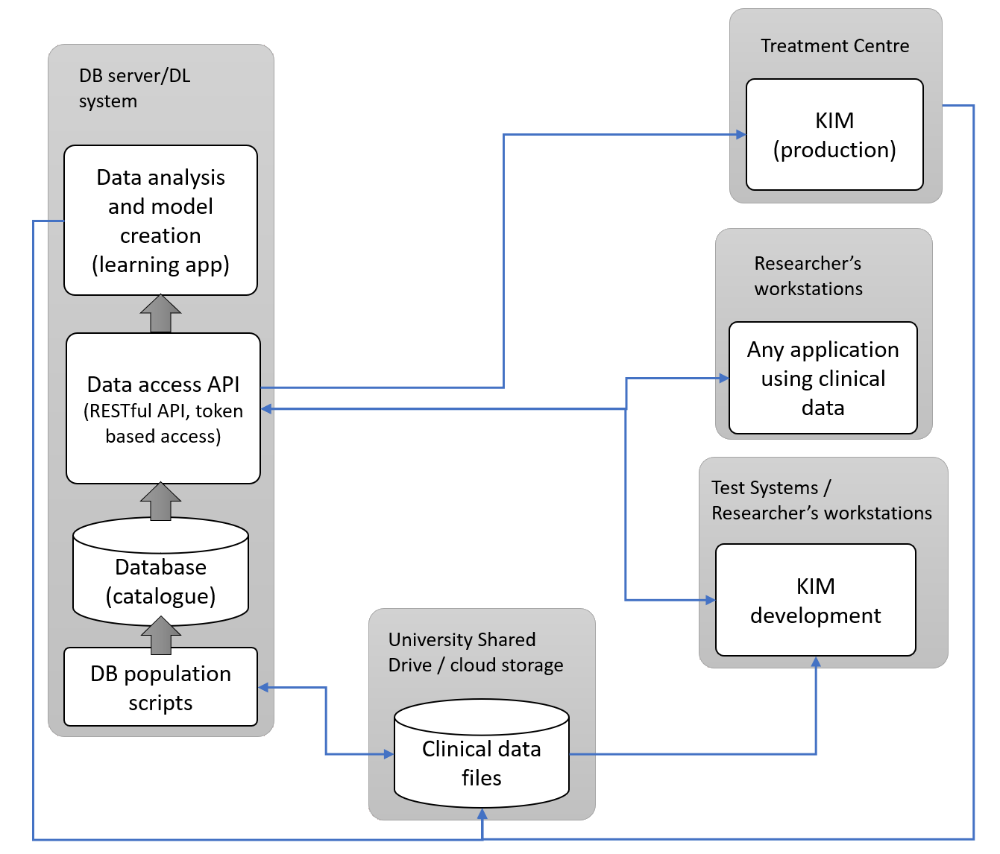

<h1 align="center">
   
  
   
  The Real-time Imaging Database
   
</h1>

This project aims to create a database of the clinical data accumulated over the years from the various projects into a central searchable service, which can be used to analyse the existing data and create models for predicting various features of interest. These features of interest can enable a customised treatment plan for the patients taking part in future clinical trials.

  <a href="#key-features">Key Features</a> •
  <a href="#design">Design</a> •
  <a href="#how-to-use">How To Use</a> •
  <a href="#user-guide-and-documentation">Documentation</a> •
  <a href="#license">License</a>

## Key Features
* Restructuring of clinical data into a hierarchy that is efficient to access for research purposes.
* Host of a relational database to manage the clinical data record. 
* Role-based access control system to manage the access to the database.
* Web-based user interface to manage the database and access the data.
* Python-flask API server for researchers to access the data.
* Python PySide6 application for importing data into the database.

## Design

## How To Use
The project contains three main components:
* The database server ([data_service](data_service))
* The web application ([admin_console](admin_console))
* The content uploader application ([content_uploader](content_uploader))

In order to setup the project in a new environment, the prerequisites are:
* Python 3.9+
* PostgreSQL 14
* Conda 4.10

After installing the prerequisites, the database server can be setup by following the documentation in the [LEARN DB Deployment Guide](docsrc/Local_Deployment_Guide.md) folder.

The web application is a flask application with simple Jinja templates. The application can be setup by following the documentation in the [Admin Console Deployment Guide](admin_console/readme.md).

## User Guide and Documentation
The user guide for general users can be found in the [docs](docs/User_Guide_Data_import.pdf) folder.

The documentation for the project can be found in the [docsrc](docsrc) folder.

## License
TBA

External Packages used:
* [Flask](https://flask.palletsprojects.com/en/2.0.x/) - [BSD-3-Clause Source License](https://flask.palletsprojects.com/en/2.0.x/license/)
* [PySide6](https://doc.qt.io/qtforpython/PySide6/PySide6-index.html) - [LGPLv3 License](https://doc.qt.io/qtforpython/licenses.html)
* [pyinstaller](https://www.pyinstaller.org/) - [GPLv2 License](https://www.pyinstaller.org/license.html)
* [waitress](https://docs.pylonsproject.org/projects/waitress/en/stable/) - [ZPL License](https://docs.pylonsproject.org/projects/waitress/en/stable/license.html)
* [msal](https://github.com/AzureAD/microsoft-authentication-library-for-python) - [MIT License](https://github.com/AzureAD/microsoft-authentication-library-for-python/blob/dev/LICENSE)
* [psycopg2](https://www.psycopg.org/docs/) - [LGPLv3 License](https://www.psycopg.org/docs/license.html)
* [pyjwt](https://pyjwt.readthedocs.io/en/stable/) - [MIT License](https://github.com/jpadilla/pyjwt/blob/master/LICENSE)
* [gunicorn](https://gunicorn.org/) - [MIT License](https://github.com/benoitc/gunicorn/blob/master/LICENSE)
* [pandas](https://pandas.pydata.org/) - [BSD-3-Clause License](https://pandas.pydata.org/docs/)
* [pyminizip](https://pypi.org/project/pyminizip/) - [zlib License](https://github.com/smihica/pyminizip/blob/master/COPYING.txt)
