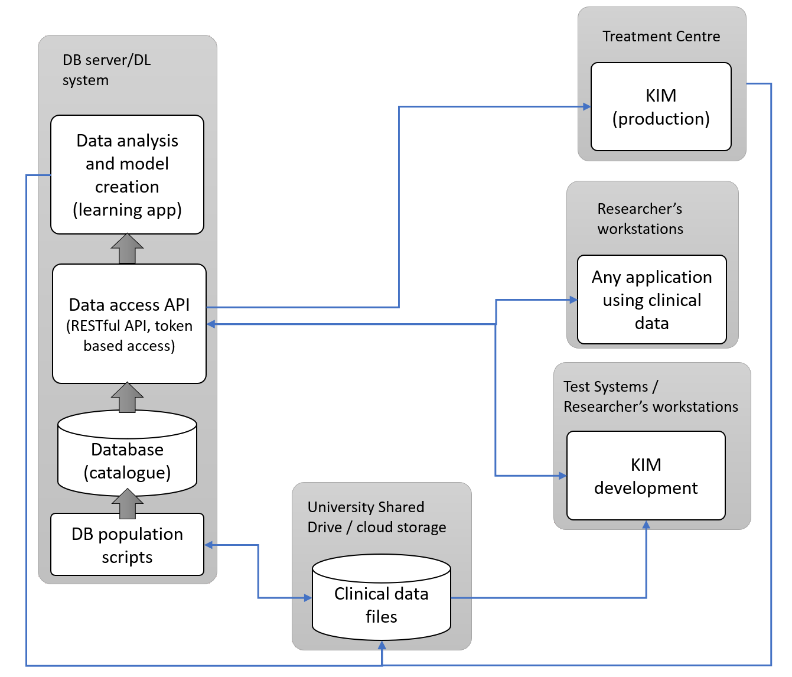

<h1 align="center">
  <br>
  <a href="https://image-x.sydney.edu.au/"></a>
  <br>
  The Real Time Imaging Database
  <br>
</h1>


<p>
This project aims to create a secure and easy-to-use mechanism for managing the already acquired and to-be-generated clinical trial data into a central searchable service, which can be used to analyse clinical data and create deep-learning models for predicting various features of interest. The learning system provides a RESTful API for ease of integration with existing and new applications that produce or require access to the de-identified patient data to researchers, clinicians, and other health professionals who want to use the available clinical data.
</p>

<p align="center">
  <a href="#key-features">Key Features</a> •
  <a href="#design">Design</a> •
  <a href="#installation">Installation</a> •
  <a href="#license">License</a> •
  <a href="#authors">Authors</a> •
  <a href="#acknowledgements">Acknowledgements</a>
</p>

## Key Features
* Restructuring of clinical data into a hierarchy that is efficient to access for research purposes.
* Host of a relational database to manage the clinical data record. 
* Role-based access control system to manage the access to the database.
* Web-based user interface to manage the database and access the data.
* Python-flask API server for researchers to access the data.
* Python PySide6 application for importing data into the database.

## Design


## Installation
The project contains two main components:
* The database server ([data_service](src/data_service))   
  - The main flask application that hosts the database server.
* The database front application ([Learndb_manager](https://github.com/Image-X-Institute/learndb-manager))  
  - The database management application based on Reactjs.


The fowllowing components are not in use anymore, but still be able to run:
* The web application ([admin_console](src/admin_console)) - Archive   
  - The web application for admin to manage the import data.
* The content uploader application ([content_uploader](src/content_uploader)) - Archive   
  - The application for users to import data into the database.   
  
The documentation for the project can be found here:  
* The user guide for general users can be found in the [docs](docs/Docs_for_importing_new_patient_data.pdf) folder.
* The documentation for the project can be found in the [doc](docs/deployment_guide) folder.

The file structure of the project is as follows:
```
.
├── src/
│   ├── admin_console/ (The web application for management of import data)
│   ├── content_uploader/ (Frontend for supporting import of files into the database)
│   ├── data_service (The main database server hoster)
│   └── db_updater (Application to parse files and update the database)
└── scripts/
    ├── db/ (Database schema and other scripts)
    └── service/
        ├── data_service.sh (The script to start the database server on Linux system)
        ├── install_service.bat
        └── learndb.service (The service file of the database server for Linux system)
```


In order to setup the project in a new environment, the prerequisites are:
* Python 3.9+
* PostgreSQL 14
* Conda 4.10

After installing the prerequisites, the database server can be setup by following the documentation in the [LEARN DB Deployment Guide](docs/deployment_guide/Local_Deployment_Guide.md) folder.

The web application is a flask application with simple Jinja templates. The application can be setup by following the documentation in the [Admin Console Deployment Guide](admin_console/readme.md).


## License
This project is licensed under the MIT License - see the [LICENSE](LICENSE) file for details.

External Packages used:
* [Flask](https://flask.palletsprojects.com/en/2.0.x/) - [BSD-3-Clause Source License](https://flask.palletsprojects.com/en/2.0.x/license/)
* [PySide6](https://doc.qt.io/qtforpython/PySide6/PySide6-index.html) - [LGPLv3 License](https://doc.qt.io/qtforpython/licenses.html)
* [pyinstaller](https://www.pyinstaller.org/) - [GPLv2 License](https://www.pyinstaller.org/license.html)
* [waitress](https://docs.pylonsproject.org/projects/waitress/en/stable/) - [ZPL License](https://docs.pylonsproject.org/projects/waitress/en/stable/license.html)
* [msal](https://github.com/AzureAD/microsoft-authentication-library-for-python) - [MIT License](https://github.com/AzureAD/microsoft-authentication-library-for-python/blob/dev/LICENSE)
* [psycopg2](https://www.psycopg.org/docs/) - [LGPLv3 License](https://www.psycopg.org/docs/license.html)
* [pyjwt](https://pyjwt.readthedocs.io/en/stable/) - [MIT License](https://github.com/jpadilla/pyjwt/blob/master/LICENSE)
* [gunicorn](https://gunicorn.org/) - [MIT License](https://github.com/benoitc/gunicorn/blob/master/LICENSE)
* [pandas](https://pandas.pydata.org/) - [BSD-3-Clause License](https://pandas.pydata.org/docs/)
* [pyminizip](https://pypi.org/project/pyminizip/) - [zlib License](https://github.com/smihica/pyminizip/blob/master/COPYING.txt)

## Contact information
Chandrima.Sengupta@sydney.edu.au.

## Authors
Mr Indrajit Ghosh and Mr Yu Liang. 

## Acknowledgements
The authors thank all the contributors Dr. Chandrima Sengupta, Dr. Brendan Whelan, Dr. Doan Trang Nguyen, Prof. Ricky O'Brien, and Prof. Paul J Keall for lending their valuable input and expertise leading up to the initial release. 
