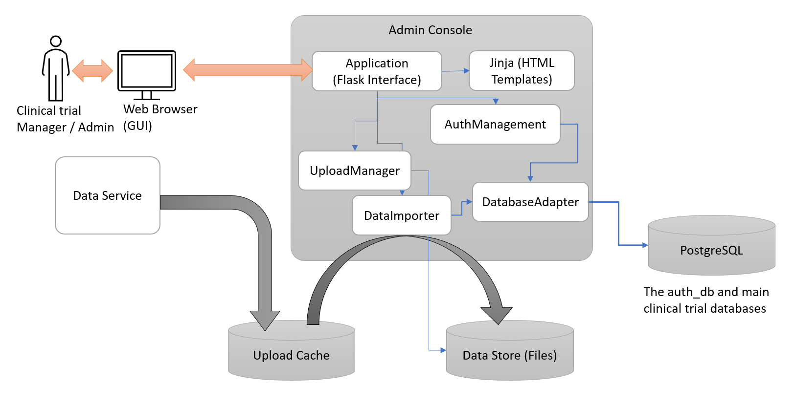

# The Admin Console

__Author__: Indrajit Ghosh

## Introduction

The Admin console is a web based tool for making some the common administration tasks of the LearnDB database easier. Its main users are the clinical trial leads (who would need to import clinical trial data into the database) as well as the administrator for the system (manging user accounts).

## Design

The Admin Console's design overview is provided by the following figure:

The Admin Console uses Python Flask along with Jinja templates to serve a basic but functional GUI to the users and internally is composed of several Python modules hat are responsible for user management (`AuthManagement` module), getting the upload packets (`UploadManager` module), importing the upload packets into the database (`DataImporter` module) and talks to the database (`DatabaseAdapter` module).

It uses a PostgreSQL backend to manage the user access using the `auth_db`. The main tables in that database are as follows:

| Table | Details |
|---|---|
| `token_details` | user details |
| `treatment_sites` | registered treatment centres |
| `trials` | registered trials |
| `acl_roles` | access control |
| `trial_site_mapping` | mapping of sites to centres |
