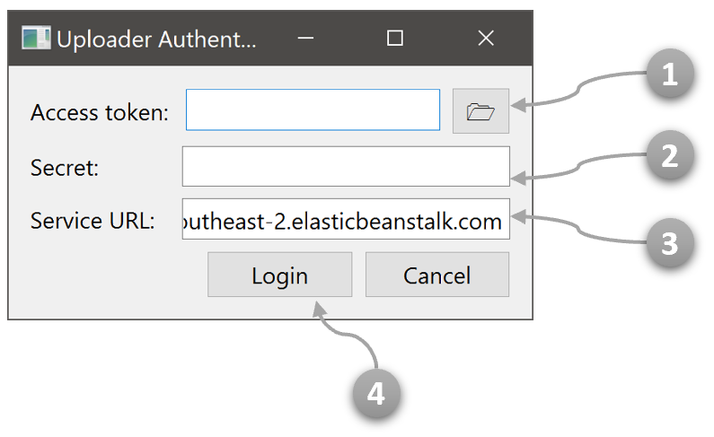
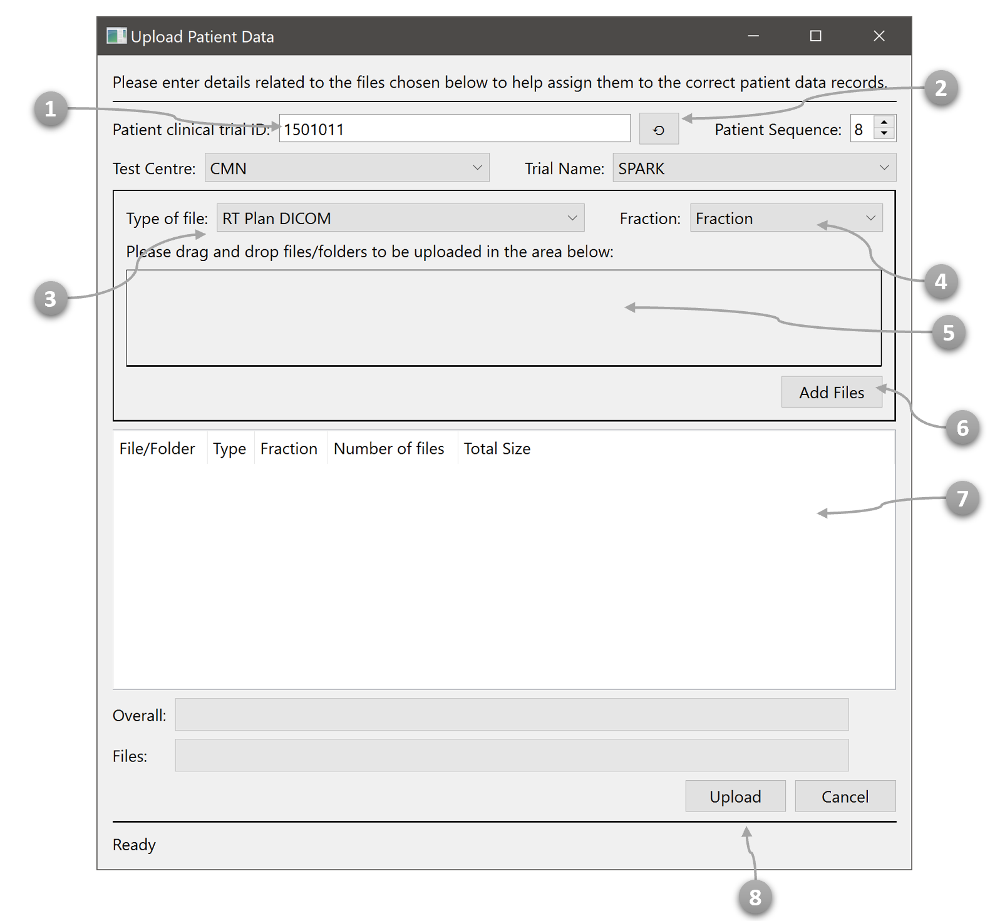

# Content Uploader

The Content Uploader is a GUI frontend to the file upload facility provided by 
the data_service for importing files and classifying them under the correct
patient / fraction / category. The files are upoaded via HTTPS and are saved
on the filesystem partition where the rest of the database files physically
exist.

To use the Content Uploader, it is necessary to have proper authentication and
be authorised to be able to import files related to a specific trial from a 
specific treatment centre. These authorisations are granted to tokens, which 
are small files containing a digitally signed token ID and other related 
details. Based to the type of token, it may be assigned a password, which would
have to entered while authenticating with the token.

Finally, the user should select the appropriate patient and type of file (and 
other relevant details such as fraction number etc.) and proceed to uploading
them.

## Executing the Content Uploader

### Invoking as a Python Module

The Content Uploader is a python 3 module, which can be invoked using the 
following command:

```bash
python ContentUploader.py
```

To make sure that all the required dependencies are available in the Python
environment, where it would run, either create a conda environment or a virtual
environment using the `requirements.txt` file to install all the required 
packages.

### Setting up the Python Environment

Please run the following commands to setup your python environment (this is 
required only once). Please ensure that the correct environment is set before 
installing the requirements. For example, if using conda, ensure that 
`conda activate <proper_environment_name>` has been executed.

#### Anaconda/Miniconda based install
```bash
conda install --file requirements.txt
```

#### Pip based install
```bash
pip install -r requirements.txt
```

### Building a Portable Executable

The Content Uploader can be built into a self contained executable file using
the `build_bins.bat` script. This uses the pyinstaller module, which is included
in the requirements. Such an execuatble is also included in the final release 
package.


## Usage Instructions

### Authentication

Upon starting the Content Uploader, it would present an authentication screen
to the user similar to the following figure.



For authenticating with the backend, the following steps should be followed as
indicated in the above figure:

1. By clicking on the open folder button, select the token file (which can be 
saved in a local drive or loaded from a USB drive etc.)
2. If the token has an associated password, then enter it in the input field
labelled "Secret:"
3. Ensure that the correct service URL is present in the next input field.
4. Finally, press the button labelled "Login".

Upon successful authentication, the authentication window would be replaced by
the main screen of the Content Uploader.

### Uploading Content

The main screen of the content uploader would be similar to the following 
figure:



To use the content uploader, the following steps should be followed matching the
labels of the above figure:

1. Enter the clinical trial ID of the patient whose files are getting uploaded;
this could be an ID issued by TROG etc.
2. Click on the button next to ID input field for the application to fetch the
details related to the patient. Verify that the patient sequence, test centre, 
trial name etc. are corect before proceeding.
3. Select the type of file(s) that are going to be uploaded. Be careful: once
this category is assigned and uploaded, it cannot be changed later.
4. If the files are related to a specific fraction, select the fraction (this
dropdown field would only be enabled if the file category is related to 
fractions insted of the overall patient records).
5. Drag and drop either a selection of files or entire folder content from the 
OS file explorer into the file recieving rectangle. Please ensure that all the 
files/folders dropped here are only related to the category selected in the
above step.
6. Click on the button labelled "Add Files". This would queue the dropped files/
folders to be uploaded. 
7. The file upload queue can list multiple set of files for uploading. To add 
multiple types of files, follow the steps 3 to 6 for each file category.
8. Finally, clicking on the button labelled "upload" would start the file
upload process.

The upload process of the files is indicated by a pair of progress indicators, 
which display the progress of individual files being transferred across the
network and the overall progress. The status area at the very bottom would 
indicate if there are any issues encountered while transferring the files.
