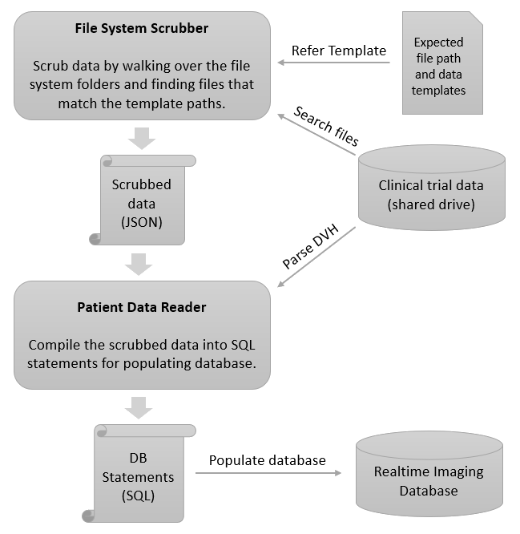

# DB Updater
This folder contains the modules and data relevant to generating the database SQL scripts by walking through the clinical data file system and parsing files to collect data about them. To make the walking process efficient, the `data` and `data/templates` folders under this folder contain a set of files which define the structure in which the data should be collected and pointers to where the data should be collected from. Please refer to [data documentation](data/README.md) for more details on these files.



## Setting Up the Development Environment
The Python modules in this folder require a specific set of site packages to be installed in the python environment. To setup these, the `requirements.txt` file can be used. Please run the following commands to setup your python environment (this is required only once). Please ensure that the correct environment is set before installing the requirements. For example, if using conda, ensure that `conda activate <proper_environment_name>` has been executed.

### Anaconda/Miniconda based install
```bash
conda install --file requirements.txt
```

### Pip based install
```bash
pip install -r requirements.txt
```

The python modules in this folder look at `data/local_settings.json` for local system specific settings. On a fresh clone of the repository, this file needs to be created (and not added to source control there after). To create this file, the template located at `data/templates/local_settings_template.json` can be copied and changed to reflect the local system settings. Please refer to [data templates documentation](data/templates/README.md) for details.

## Generating Database Scripts from Clinical Data
This folder contains a set of Python modules for scrubbing the filesystem data and generating SQL scripts from them.

### Scrubbing Filesystem
The module [FilesystemScrubber.py](FilesystemScrubber.py) is responsible for walking through the clinical data drive based on the data templates and generates a file named `scrubbed_patient_data.json` everytime the filesystem scrubber is run. This is an intermediate file, which contains all the parsed data is used as an input for generating the SQL scripts to insert data into the database.

To run this python module, run the following command:
```bash
python FilesystemScrubber.py
```

### Generating SQL scripts
The module [PatientDataReader.py](PatientDataReader.py) uses the `scrubbed_patient_data.json` file to generate the SQL insersion scripts. It expects all the paths, patient and fraction details to be in this JSON file and uses the `DVHParser.py` to parse DVH files to get the dosage information.

To run this python module, execute the following command:
```bash
python PatientDataReader.py
```

### Parsing Dose Value Histograms
While the `PatientDataReader.py` internally uses the [DVHParser.py](DVHParser.py) module to extract the dosage information, the module can be imported directly in Python code too. To use it, the `DVHParser` class can be used as follows:
```python
from DVHParser import DVHParser

parser = DVHParser(<path of the DVH file>)
parser.parse()

# print all the structures contained in the DVH file:
parser.getAllStructureNames()

```
