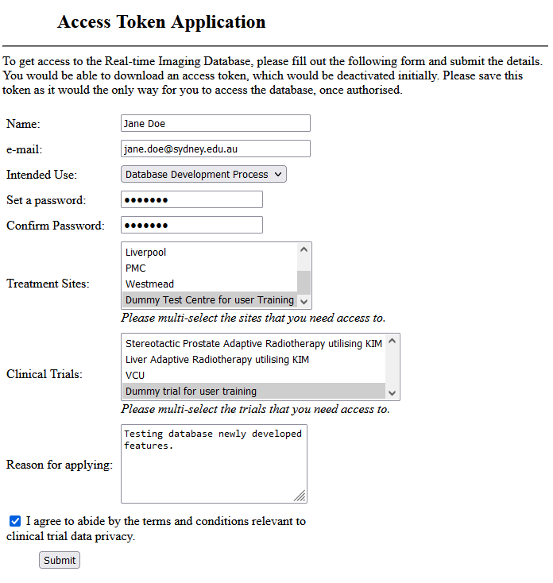

# Introduction 
This document explains the process for applying access to the database. To get access, the user specific details are required as well as the list of trails and treatment centres to which the user requires access.

# Process of Applying for Access

To apply for access, visit the access application page on the database server instance of interest. This link is usually listed on the home page of the data service and is usually of the form `<data service URL>/apply-access`. For example, if the data service of interest is running on `10.65.67.77` at port `8091` then the apply access link would be `http://10.65.67.77:8091/apply-access`.

The following screen shot shows the application page filled with some sample values: 

In this screen, the following fields should be filled:

__Name__: Fill the name that you want to be displayed as a user of the application.

__e-mail__: The e-mail address is used as a login and verification, so please ensure that a functioning email address is provided.

__Intended Use__: Select an intended use from the list provided. If you cannot find the exact usage scenario then please choose one that is close enough. The access would be approved based on this.

__Passwords__: Provide a password and repeat it again. Please remember this password since it would be required to login to the data service and its tools.

__Treatment Sites__: Select the treatment sites that you want access to.

__Clinical Trials__: Select the clinical trials that you are involved with.

__Reason__: Provide the reason why you would want access to the data.

Remember to check the "I agree" checkbox. This binds you to the current data access clauses for the clinical trails that you have selected above.

Upon submitting this information, the token and profiles would be available for download in the next screen. Please keep these safe as they are only generated once and not kept in the server for retrieving again.
