# Introduction 

The Learn DB facilitates organising the data generated during clinical trails and make it easier to use via the client libraries. The first step in organising the data is to import it into the database and this document provides a detailed process for this step.

# Roles Interacting with the Database

The Learn DB system is targeted towards making the utilisation of the clinical trail data by researchers and analysists. However, there are various roles of users who would interact with it using a different set of features. The following figures shows some of the user roles involved with interacting with the system. This document is primarily targeted towards the clinical trial leads and collaborators who would be responsible for the import of the clinical trial data into the database. 

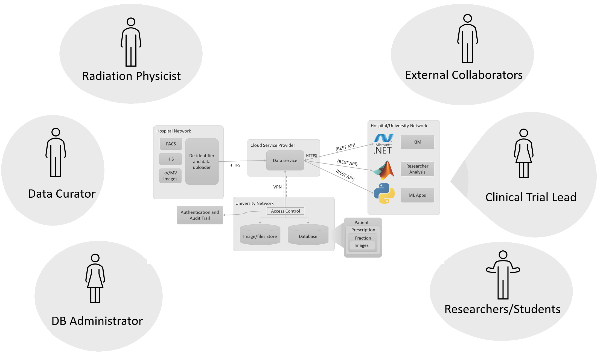

It is assumed that the clinical trial leads would be interacting with the treatment sites and clinical trail coordinators in getting the data on premise, from where the data can be easily imported.

## Uploading Data to a Database Instance

The data service of Learn DB provides the RESTful APIs for use by the end users. It also provides APIs for allowing the import of new data into the database. While it is possible it use the APIs from a script, the most convenient method would be by using the content uploader tool, which is a GUI based portable application allowing secure upload of data. Since it is portable, the executable can be simply copied to a system and used without needing to install it.

To use the tool, it is necessary to have a valid user profile and password combination. The profile can be generated by using the access grant workflow of the data service. This profile is small file with .profile as its filename extension and needs to be selected into the uploader authentication screen shown in the following figure by clicking the open folder icon next to the profile field.

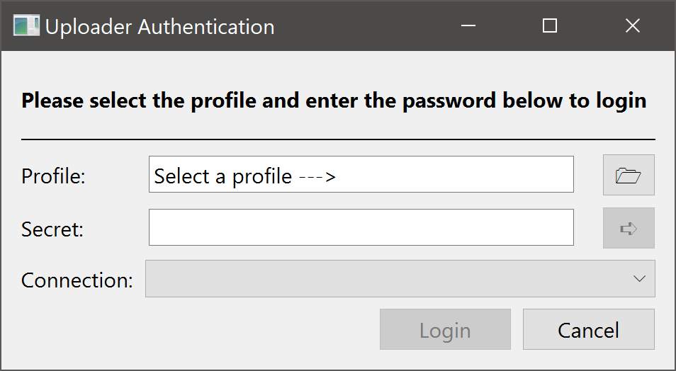

Once the profile is selected, a valid password corresponding to the profile should be typed into the field labelled as "Secret". Following this, the button with an arrow needs to be clicked, which would enable the listing of a number of connection options as shown in the following figure. 

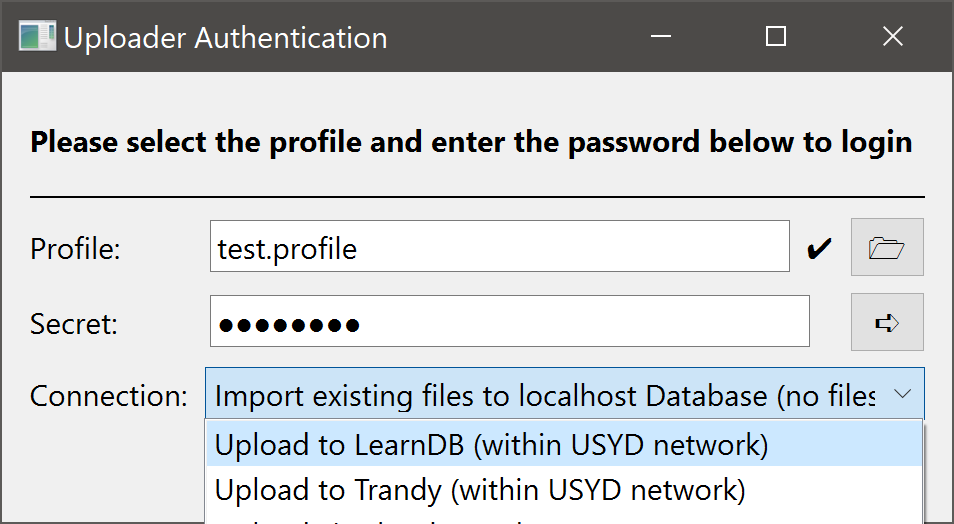

It is possible to select any one of the connection options for uploading the data. There are two kinds of options for uploading data: to actually copy the data files such as images, logs etc. into the database and register them with additional data to identify which subject, trial, fraction etc. it is associated with. The other options is to simply point already existing data in the data store and register them with the relevant metadata. The appropriate option can be chosen at this stage. Finally, the login button can be clicked to authenticate with the data service. If the authentication is successful then the following screen would be displayed. Some of the reasons for failing to authenticate can be:
+ The profile has expired or is disabled from the admin console. Contact the database administrator in this case.
+ The data service is not accessible. Please try to check the network address and see if it accessible from the computer on which the content uploader is running.
+ The data service is facing downtime. Please contact the database administrator to see if it is running.

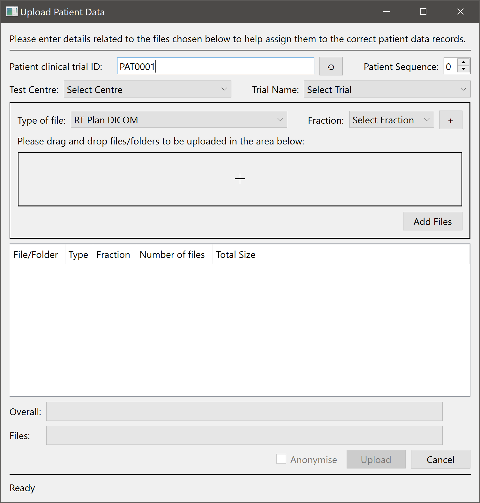

The main screen of the content uploader provides the options for selecting the appropriate clinical trial details associated with the data being uploaded. The first step to be performed on this screen is to enter a patient ID. This ID is not the same as the actual hospital ID or MRN. It is instead an ID specific to the clinical trial to avoid linking the real patient data with the clinical trial subject. If this ID already exists then the screen would automatically populate the test centre, trail etc. However, if it is a new patient then it would display a prompt to allow creating a new patient, which is detailed in the next section.

After verifying that details are correct, either a set of files or a folder can be dragged (from the file manager such as windows explorer on Windows) and dropped into the file/folder upload area and a valid type of file and fraction should be assigned to the dropped files. Finally, the selected files can be queued for upload by clicking on the "Add Files" button, which would calculate the total size of the selected files and add them to the upload queue. Multiple file sets can be selected in this manner, which may belong to different fractions - the only constraint is that they should belong to the the same patient - whose patient ID was selected to start with.

The final step for uploading the selected files is to click the "Upload" button. It is assumed that the files being uploaded are already anonymised to remove or mask any patient identifiable information. It is the responsibility of the person using this tool to ensure that the PHI data from the files has been removed.

## Adding New Patients and Fractions

While using the content uploader tool, if is a data related to a new patient, which does not exist in the database system then it is possible to add a new patient for an existing clinical trial through this tool.

When a patient ID that does not exist on the system is entered then the tool would prompt the user to create a new patient as shown in the following figure. Select Yes to proceed with creating a new patient.

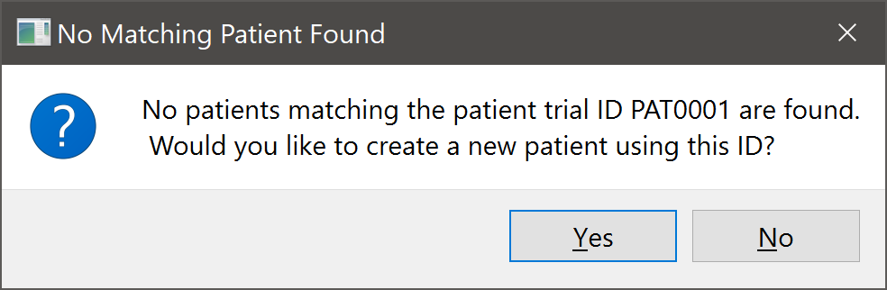

To create a new patient, the user would need to select the appropriate information related to the trial, test centre as well as other fields indicated in the add patient screen. Some fields in this screen, displayed in the figure below are optional and hence should only be entered in consultation with the clinical trial lead if they are required for the trial.

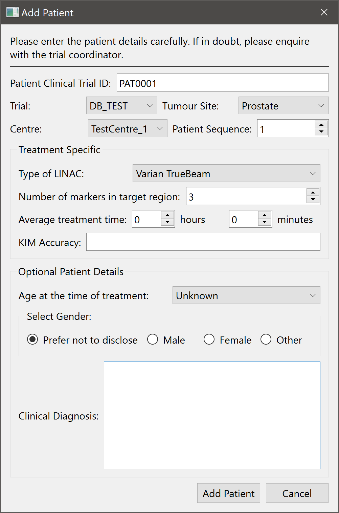

Finally, upon clicking the add patient button, a new patient would be created on the system. It is recommended to take utmost care in making sure that the data being entered in the fields of the add patient screen are correct before adding the patient.

While selecting the fraction (if the files being uploaded are fraction specific) then it is possible to create a new fraction if it already does not exist for a patient. This can be done by clicking on the button with a '+' symbol next to the fraction selection field on the main screen of the content uploader. To add a new fraction, it is necessary to know the date of the fraction and its number. It is possible to add sub fractions by setting a different name for each fraction (such as Fx01a, Fx01b etc.)

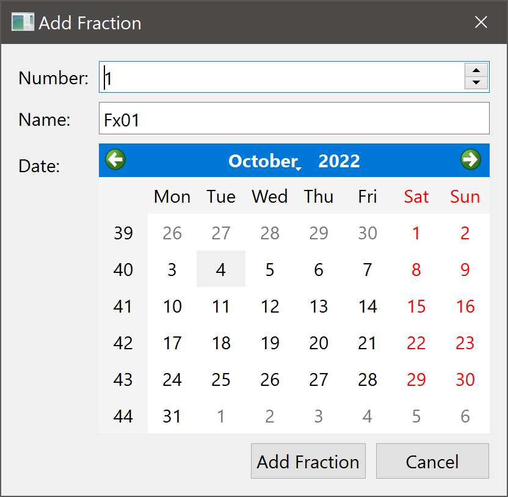

## Data Upload Approval process

Once the content uploader tool successfully uploads the clinical trial data to the data service, it does not automatically get added to the database. Its is instead cached in an intermediate storage to allow for any human mistakes or inconsistencies to be avoided. The clinical trial lead need to go through the upload packets and accordingly either allow or reject the uploads. This process is shown in the following figure.

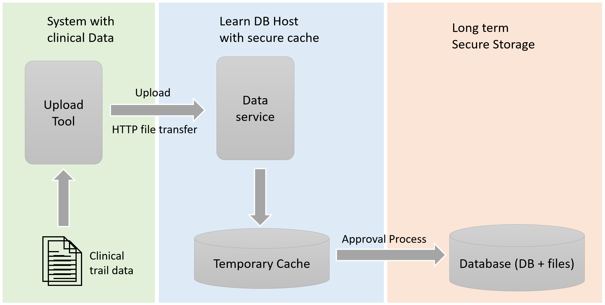

To enable the approval workflow, the admin tool allows a valid user to login and select the uploads for approval. To login into the tool, it is necessary to use the email address and password, which were specified while applying for access to the Learn DB system as shown in the figure below.

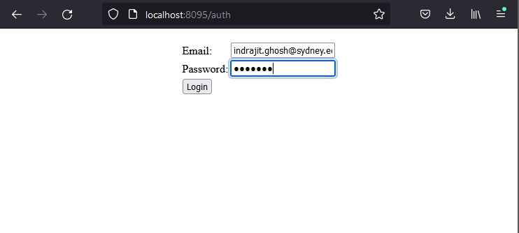

Upon logging in, the tool would display a list of uploads currently available, which can be imported. Upon clicking on the upload ID, it is possible to see the details of the upload.

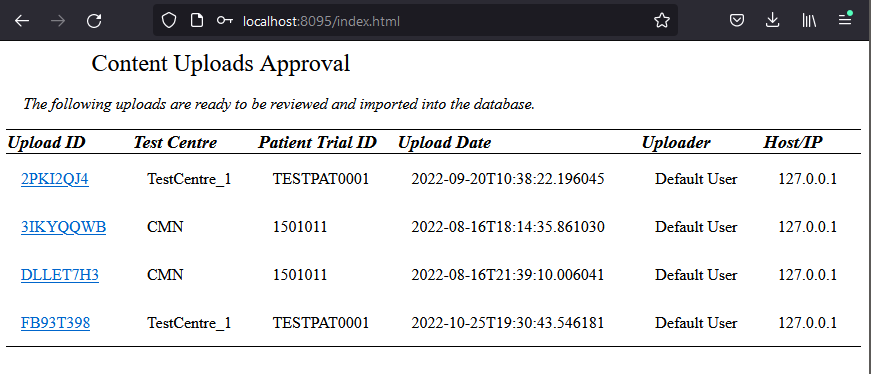

On the upload details screen, after verifying that all the data waiting for import is correct, the import button can be clicked as shown in the following figure. Alternatively, the upload may be rejected if there is any issue with it.

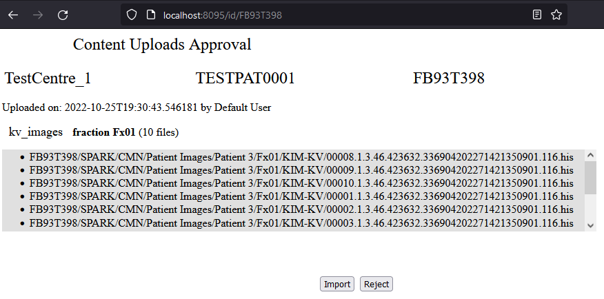
