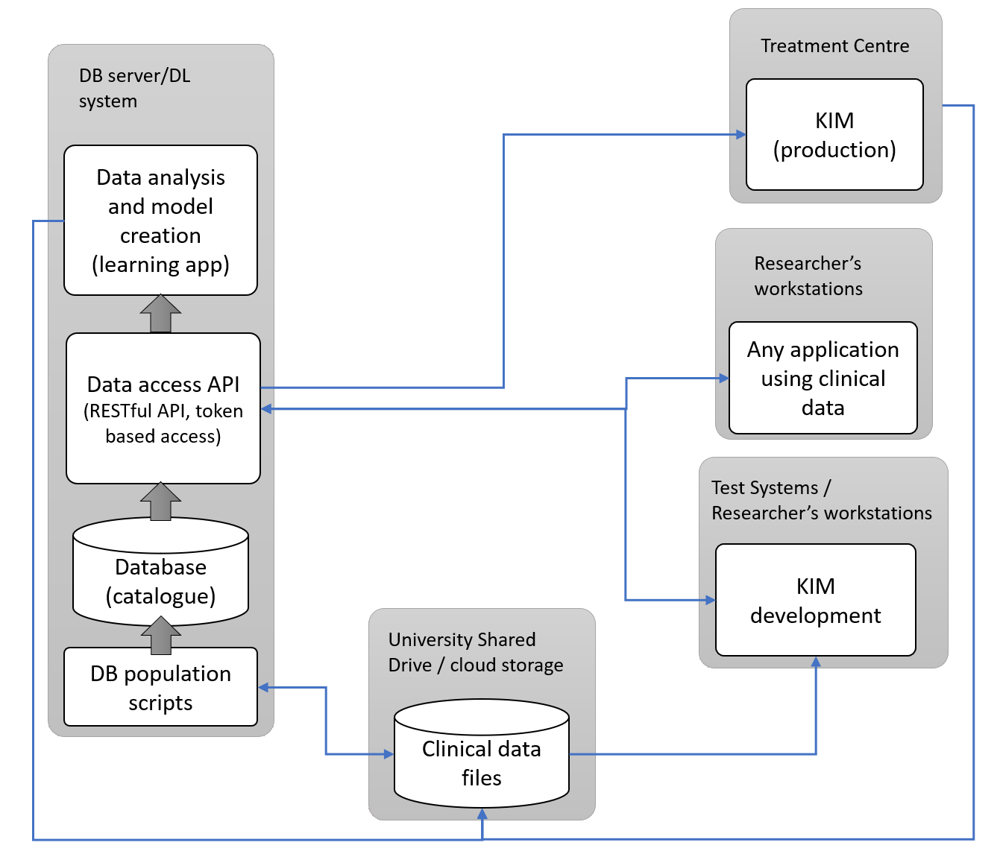

# The Real-time Imaging Database and Analysis Project Repository

## Introduction
This project aims to create a database of the clinical data accumulated over the years from the various projects into a central searchable service, which can be used to analyse the existing data and create models for predicting various features of interest. These features of interest can enable a customised treatment plan for the patients taking part in future clinical trials.


## Scope
The high-level scope of the project are as follows:

- Restructuring of clinical data currently existing in the research network share into a hierarchy that is efficient to access and easy to use
- Implementing a relational database-based data catalogue that can be looked up in an efficient manner without needing to parse the individual files on disk
- Ensuring the integrity of data and preventing its accidental modification: enabling role-based access to data with proper authentication mechanism
- Implementing a multi-platform set of interfaces, which can be used by various applications to access the data for retrieving, adding, and updating the underlying database
- Implement a logistical regression-based prediction mechanism for marker sizes, dose and imaging properties using key features to support PERK applications
- Implement a deep learning-based recommendation mechanism for marker sizes, dose and imaging properties

## Design


## Repository Layout

The following structure lists the repository folder structure and can be a helpful reference while adding new projects and files to it.

```
.
├── data_service       (The data service implementation)
├── db_updater         (Application to parse files and update the database)
├── content_uploader   (Frontend for supporting import of files into the database)
├── filesystem_utils   (Collection of filesystem utilities)
├── docs               (documentation)
├── scripts            (all sorts of scripts used here)
│   └── db               (Database schema and other scripts)
└── test_clients       (test clients for the data service)
    ├── dot_net_clients
    ├── matlab_clients
    └── python_clients

```

## Project Documentation

To refer to the project documentation for further details, please use the `Real-time imaging DB and Analysis Project` channel of the Microsoft Teams group of Image-X.

## Working with code

This repository uses a variety of coding platforms to implement the data access service and provide API support for various test clients. This section explains how to browse and modify the source code in this repository. While any choice of editors/IDE may be used, the [Visual Studo Code](https://code.visualstudio.com/download) is highly recommended as it is a one stop shop for various languages and development platorms and would support opening most of the code files in this repository. To open the netire workspace containing all the projects, open visual Studio Code and then select the File > Open Workspace menu and open the `workspace.code-workspace` file.

### Data Access Service
The data access service is located in the data_service subfolder and is written ins Python using Flask for enabling a web based interface and psypopg2 for database access. The easiest way to setup the development environment for this project is to create a Python environment (either via [Anaconda](https://www.anaconda.com)/[Miniconda](https://docs.conda.io) or Python's [virtualenv module](https://docs.python.org/3/library/venv.html) ) and use [pip](https://packaging.python.org/tutorials/installing-packages/) with the following command to install all the required dependencies:

```bash
python3 -m pip -r requirements.txt
```

The detailed instructions to run the data service are covered in the [README](data_service/README.md) file under the data_service folder.

### Database creation and querying

All the database related scripts including the schema required to initally setup the database are kept in the `scripts/db` folder. To connect with the database service, the [dbeaver](https://dbeaver.io/download/) universal DB client is recommended.

### API Test Code

The test code for multiple languages is kept under the `test_clients` folder and can be opened as per the instructions in the individual README files. These test clients help test the APIs and provide a reference code for connecting to the data access service.

